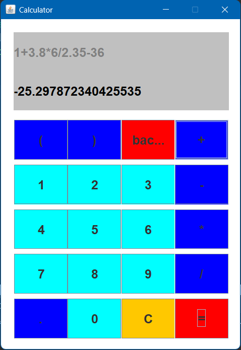

# Java Swing Calculator

A simple yet elegantly designed calculator application built using Java Swing. This project demonstrates the use of Java Swing for creating a graphical user interface (GUI) and is styled based on a custom design.

## Features

- **Custom Design**: A visually appealing layout for an enhanced user experience.
- **Basic Arithmetic Operations**: Addition, subtraction, multiplication, and division.
- **Error Handling**: Handles divide-by-zero and other invalid inputs gracefully.
- **Real-Time Updates**: Results are displayed dynamically as you calculate.

## Technologies Used

- Java
- Java Swing (for GUI)

## Screenshots



## Installation and Usage

1. **Clone the Repository**:
   ```bash
   git clone https://github.com/akashgardas/Java-Swing-Calculator.git
   ```

2. **Navigate to the Project Directory**:
   ```bash
   cd Java-Swing-Calculator
   ```

3. **Compile and Run the Application**:
   ```bash
   javac -d bin src/main/*.java
   java -cp bin main.Main
   ```

4. **Run the Prebuilt Executable (Optional)**:
   If you prefer, you can directly run the provided `.jar` file:
   ```bash
   java -jar JavaSwingCalculator.jar
   ```

## Project Structure

```
Java-Swing-Calculator/
├── src/                            # Source code files
│   ├── main                        # Main package
│   |   ├── Main.java               # Entry point of the application
│   │   └── CalculatorFrame.java    # GUI display component
│   ├── panels                      # Panels source package
│   │   ├── Content.java            # Content of the Calculator
│   │   └── Display.java            # Display of the Calculator
│   └── buttons                     # Buttons package
│       ├── Numeric.java            # Base class for Numbers
│       ├── Operator.java           # Base class for Operators
│       └── Special.java            # Base class for Special Buttons
├── resources/                      # Assets such as images and icons
├── docs/                           # Documentation files
├── bin/                            # Compiled classes
├── README.md                       # Project documentation
└── LICENSE                         # License information
```

## Contribution

Contributions are welcome! Follow these steps to contribute:

1. Fork the repository.
2. Create a feature branch.
   ```bash
   git checkout -b feature/YourFeatureName
   ```
3. Commit your changes.
   ```bash
   git commit -m "Add YourFeatureName"
   ```
4. Push to the branch.
   ```bash
   git push origin feature/YourFeatureName
   ```
5. Open a pull request.

## License

This project is licensed under the [MIT License](LICENSE).

## Acknowledgments

- Special thanks to [your professor or inspiration, if any].
- Icons and design inspirations from [source if applicable].
